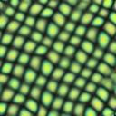

# cg-assignment-i3
ファイルの説明:  
`texture.py`:テクスチャ合成を行うpythonコードです。大域的に探索ステップ、混合ステップを繰り返すことでテクスチャ合成を行います(局所的なものは実装したもののうまく合成できなかったためこちらのみ提出します)。以下のオプションでステップ数やパッチの大きさ、Random Searchの確率($1$ならば通常の合成)を変えることができます。
```bash
[computer graphics assignment i3] generate the texture from the sample source image

positional arguments:
  source_file           Path to the source image file
  target_file           Path to save the target image file

options:
  -h, --help            show this help message and exit
  -W WIDTH, --width WIDTH
                        Specify the width (default: same as the source file)
  -H HEIGHT, --height HEIGHT
                        Specify the height (default: same as the source file)
  -e, --save-each-step  save image each epoch
  -p PROBABILITY, --probability PROBABILITY
                        probability to adopt a patch (default: 1)
  -t T_SIZE, --t-size T_SIZE
                        patch size (default: 30)
  -s STEPS, --steps STEPS
                        number of steps (default: 10)
```
またソースコード中の`probability2`の値を変えると、探索を行う`source image`の中のパッチを一定の割合に制限することができます。  
`target.jpg`は実際に`sample.jpg`をもとに合成したものになります。確かに同様のパターンが合成できていることがわかります。  
sample.jpg  
    
target.jpg  
　  
